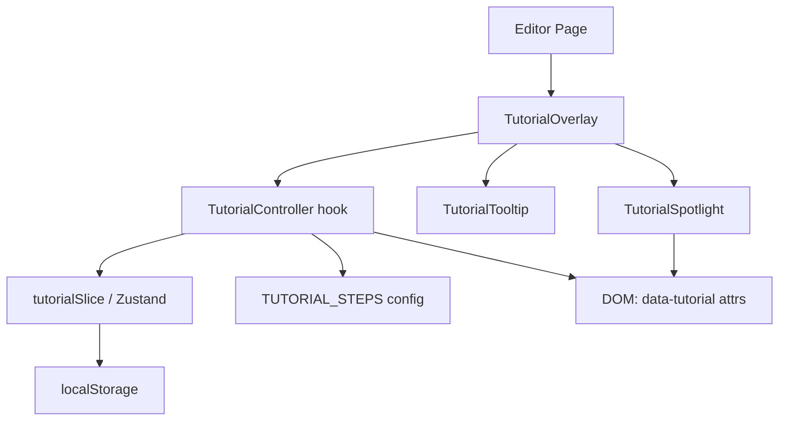

# Design Document: In-App Tutorial

## Overview

The in-app tutorial is an overlay-driven, contextual walkthrough that guides new musicians through every core feature of MusicVid Pro. It renders directly on top of the existing editor UI — no separate page or route — using a semi-transparent backdrop with a "spotlight" cutout that focuses attention on real DOM elements. A floating tooltip card provides step copy, navigation controls, and progress indicators.

The system is built as a self-contained React feature that integrates with the existing Zustand store (via a new `tutorialSlice`) and persists progress to `localStorage`. It does not modify any existing editor components beyond adding a single `data-tutorial` attribute to target elements and mounting the tutorial overlay in the editor page.

### Key Design Decisions

- **DOM-based spotlight**: Uses `getBoundingClientRect()` + a CSS clip-path or SVG mask to cut a hole in the overlay, rather than a canvas approach. This keeps the implementation simple and naturally handles element repositioning via a `ResizeObserver` + `requestAnimationFrame` loop.
- **Attribute-based targeting**: Tutorial steps reference target elements via `data-tutorial="<step-id>"` attributes. This decouples step definitions from component internals and makes it easy to add/remove targets without touching tutorial logic.
- **Slice-based state**: Tutorial state lives in a new `tutorialSlice` added to the existing Zustand store, consistent with the project's architecture.
- **Versioned localStorage key**: Progress is stored under a versioned key (`mvp_tutorial_v1`) so content updates can invalidate stale progress gracefully.
- **No new routing**: The tutorial is a pure overlay; it does not navigate away from `/editor`.

---

## Architecture



The tutorial feature consists of:

1. **`TUTORIAL_STEPS` config** — a static array of step definitions (module, target selector, title, copy). This is the single source of truth for all tutorial content.
2. **`tutorialSlice`** — Zustand slice owning tutorial state (active, currentStepIndex, completed, dismissed).
3. **`useTutorialController` hook** — orchestrates step sequencing, DOM targeting, spotlight geometry, scroll-into-view, and localStorage persistence.
4. **`TutorialOverlay` component** — renders the backdrop, spotlight cutout, and mounts the tooltip.
5. **`TutorialTooltip` component** — renders step copy, navigation buttons, progress indicator, and module label.
6. **`TutorialLauncher` component** — renders the welcome prompt (first-time) and the persistent "?" toolbar button.

The overlay is mounted at the root of the editor page, above all other content (`z-index: 9999`), and uses `pointer-events: none` on the backdrop with `pointer-events: auto` restored only on the tooltip. The spotlight region passes pointer events through via a CSS `clip-path` trick (the backdrop has a hole punched in it using an SVG `<mask>` or a `clip-path` polygon).

---

## Components and Interfaces

### `TUTORIAL_STEPS` — Step Definition Config

```typescript
// lib/tutorial/tutorialSteps.ts

export type TutorialStep = {
  id: string;
  module: TutorialModule;
  targetSelector: string;        // data-tutorial attribute value, e.g. "toolbar"
  title: string;
  body: string;                  // Musician-friendly explanation
  tooltipPlacement?: 'below' | 'above' | 'left' | 'right'; // preferred, auto-adjusted
};

export type TutorialModule =
  | 'Getting Started'
  | 'Timeline Editing'
  | 'BPM & Tempo Sync'
  | 'Time-Stretch & Pitch'
  | 'Multi-Cam Sync'
  | 'Video Speed'
  | 'Waveform Visualization'
  | 'Metronome Overlay'
  | 'Recording'
  | 'Export'
  | 'Project Saving';

export const TUTORIAL_STEPS: TutorialStep[] = [ /* ... 24+ steps ... */ ];
```

Steps are grouped by module. Each step's `targetSelector` maps to a `data-tutorial` attribute on an existing editor component. If the target element is not found in the DOM, the controller skips the step and logs a warning.

### `tutorialSlice`

```typescript
// stores/slices/tutorialSlice.ts

export interface TutorialState {
  tutorialActive: boolean;
  tutorialCurrentStepIndex: number;
  tutorialCompleted: boolean;
  tutorialDismissed: boolean;
  tutorialShowWelcome: boolean;   // true on first load for new users
}

export interface TutorialActions {
  startTutorial: () => void;
  resumeTutorial: () => void;
  pauseTutorial: () => void;
  exitTutorial: () => void;
  completeTutorial: () => void;
  goToNextStep: () => void;
  goToPreviousStep: () => void;
  goToStep: (index: number) => void;
  dismissWelcome: () => void;
  resetTutorialProgress: () => void;
}
```

The slice is added to `editorStore.ts` alongside the existing five slices. It does **not** participate in the undo/redo snapshot system (tutorial state is not part of the editor's creative history).

### `useTutorialController` hook

```typescript
// lib/hooks/useTutorialController.ts

export function useTutorialController(): {
  currentStep: TutorialStep | null;
  spotlightRect: DOMRect | null;
  totalSteps: number;
  currentStepNumber: number;   // 1-based
} 
```

Responsibilities:
- Reads `tutorialCurrentStepIndex` from the store
- Looks up the target element via `document.querySelector('[data-tutorial="<id>"]')`
- If not found: calls `goToNextStep()` and logs a warning
- If found but off-screen: calls `element.scrollIntoView({ behavior: 'smooth', block: 'center' })` then waits one frame before computing the rect
- Attaches a `ResizeObserver` on the target element and a `window` resize listener; both trigger a rect recompute within one `requestAnimationFrame`
- Persists `tutorialCurrentStepIndex` to `localStorage` (key: `mvp_tutorial_v1`) within 500ms via a debounced write
- On mount, reads localStorage and calls `goToStep()` or `resetTutorialProgress()` as appropriate

### `TutorialOverlay` component

```typescript
// components/editor/TutorialOverlay.tsx

export function TutorialOverlay(): React.ReactElement | null
```

- Returns `null` when `tutorialActive` is false
- Renders a full-viewport `<div>` with `position: fixed; inset: 0; z-index: 9999`
- The backdrop uses an SVG `<mask>` (or CSS `clip-path` polygon) to punch a transparent hole at `spotlightRect` coordinates, achieving the spotlight effect
- The backdrop `div` has `pointer-events: none`; the spotlight hole passes events through naturally
- Mounts `<TutorialTooltip>` positioned relative to `spotlightRect`
- Includes an ARIA live region (`aria-live="polite"`) that announces step title + module name on step change

### `TutorialTooltip` component

```typescript
// components/editor/TutorialTooltip.tsx

type TutorialTooltipProps = {
  step: TutorialStep;
  spotlightRect: DOMRect;
  stepNumber: number;
  totalSteps: number;
  onNext: () => void;
  onBack: () => void;
  onSkip: () => void;
};

export function TutorialTooltip(props: TutorialTooltipProps): React.ReactElement
```

- Computes preferred position (below/above/left/right of spotlight) and clamps to viewport bounds
- Renders: module label, step title, body copy, step counter ("Step N of M"), Back / Next buttons, Skip link
- Back button is `disabled` on step 0
- On the final step, Next button reads "Finish" and calls `completeTutorial()`
- Focus is moved to the tooltip container when a new step becomes active (`useEffect` + `ref.current?.focus()`)
- Tab order: Back → Next → Skip
- Escape key listener calls `pauseTutorial()` and shows a resume/exit prompt

### `TutorialLauncher` component

```typescript
// components/editor/TutorialLauncher.tsx

export function TutorialLauncher(): React.ReactElement
```

- Renders a `"?"` icon button in the Toolbar (added to `Toolbar.tsx`)
- On first load for a new user (`tutorialShowWelcome === true`), renders a welcome modal (using the existing `Dialog` component) offering "Start Tutorial" and "Skip for now"
- "Start Tutorial" calls `startTutorial()`
- "Skip for now" calls `exitTutorial()` (marks dismissed)
- The persistent `"?"` button always calls `startTutorial()` or shows a resume/restart choice if progress exists

---

## Data Models

### localStorage Schema

```typescript
// Key: "mvp_tutorial_v1"
type TutorialProgress = {
  stepIndex: number;       // last saved step index
  completed: boolean;
  dismissed: boolean;
};
```

The version suffix `_v1` in the key allows future tutorial content updates to invalidate stale progress by changing the key to `_v2`, etc. The `tutorialSlice` checks for the presence of the current key on init; if absent (or if the stored `stepIndex` exceeds `TUTORIAL_STEPS.length - 1`), it resets to step 0.

### `TutorialStep` (full shape)

```typescript
type TutorialStep = {
  id: string;                    // unique, kebab-case
  module: TutorialModule;        // display name of the feature group
  targetSelector: string;        // value of data-tutorial attribute on target element
  title: string;                 // short step title
  body: string;                  // musician-friendly explanation (1-3 sentences)
  tooltipPlacement?: 'below' | 'above' | 'left' | 'right';
};
```

### `TutorialState` (Zustand slice)

```typescript
type TutorialState = {
  tutorialActive: boolean;           // overlay is currently shown
  tutorialCurrentStepIndex: number;  // 0-based index into TUTORIAL_STEPS
  tutorialCompleted: boolean;        // user finished all steps
  tutorialDismissed: boolean;        // user clicked "Skip for now" or "Skip Tutorial"
  tutorialShowWelcome: boolean;      // show welcome prompt on load
};
```

### `data-tutorial` Attribute Map

Each target element in the editor receives a `data-tutorial` attribute. The mapping:

| `data-tutorial` value | Component | Element |
|---|---|---|
| `toolbar` | `Toolbar.tsx` | Toolbar root `div` |
| `toolbar-playback` | `Toolbar.tsx` | Play/Pause/SkipBack group |
| `toolbar-bpm` | `Toolbar.tsx` | `BPMControl` wrapper |
| `toolbar-save` | `Toolbar.tsx` | Save button |
| `toolbar-export` | `Toolbar.tsx` | Export button |
| `toolbar-metronome` | `Toolbar.tsx` | Timer icon button |
| `toolbar-split` | `Toolbar.tsx` | Scissors button |
| `tracklist` | `TrackList.tsx` | TrackList root `div` |
| `tracklist-upload` | `TrackList.tsx` | Upload rail button |
| `tracklist-record` | `TrackList.tsx` | Record rail button |
| `video-preview` | `VideoPreview.tsx` | Preview container |
| `timeline` | `Timeline.tsx` | Timeline container `div` |
| `inspector` | `InspectorPanel.tsx` | InspectorPanel root `div` |
| `inspector-adjust` | `InspectorPanel.tsx` | Adjust tab button |
| `multicam-sync` | `MultiCamSync.tsx` | MultiCamSync root |
| `metronome-overlay` | `MetronomeOverlay.tsx` | MetronomeOverlay root |
| `recording-panel` | `RecordingPanel.tsx` | RecordingPanel root |
| `waveform` | `TimelineTrack.tsx` | First audio track clip |

---

## Correctness Properties

*A property is a characteristic or behavior that should hold true across all valid executions of a system — essentially, a formal statement about what the system should do. Properties serve as the bridge between human-readable specifications and machine-verifiable correctness guarantees.*

### Property 1: Progress persistence round-trip

*For any* tutorial step index between 0 and `TUTORIAL_STEPS.length - 1`, writing that index to localStorage via the persistence helper and then reading it back should produce the same index.

**Validates: Requirements 4.1, 4.2**

---

### Property 2: Stale progress is reset

*For any* stored step index that is greater than or equal to `TUTORIAL_STEPS.length`, loading tutorial progress should reset the step index to 0.

**Validates: Requirements 1.6, 4.5**

---

### Property 3: Step skipping on missing target

*For any* sequence of tutorial steps where some steps have a missing DOM target (mocked as `null`), the controller's skip logic should advance past all missing-target steps, and the resulting active step should always have a valid target or the tutorial should be at its end.

**Validates: Requirements 2.6**

---

### Property 4: Tooltip stays within viewport

*For any* spotlight rectangle and viewport dimensions, the computed tooltip position should be fully contained within the viewport bounds (`left >= 0`, `top >= 0`, `left + tooltipWidth <= viewportWidth`, `top + tooltipHeight <= viewportHeight`).

**Validates: Requirements 3.3**

---

### Property 5: Spotlight matches element bounding rect

*For any* target element with any bounding rectangle, the spotlight region rendered by the overlay should have the same `x`, `y`, `width`, and `height` as the element's `getBoundingClientRect()` result.

**Validates: Requirements 2.2**

---

### Property 6: Navigation state consistency

*For any* step index, the Back button should be disabled if and only if the index is 0, and the primary action button label should be "Finish" if and only if the index is the last step index (`TUTORIAL_STEPS.length - 1`).

**Validates: Requirements 3.4**

---

### Property 7: Tooltip content completeness

*For any* `TutorialStep` object, rendering the `TutorialTooltip` should produce output that contains the step's title, body text, module name, and a step counter string of the form "Step N of M" where N is the 1-based step number and M is the total step count.

**Validates: Requirements 3.1, 3.5, 3.6**

---

### Property 8: Tooltip does not overlap spotlight

*For any* spotlight rectangle and viewport dimensions, the computed tooltip position should not overlap the spotlight rectangle (i.e., the tooltip rect and spotlight rect should be non-intersecting).

**Validates: Requirements 3.2**

---

### Property 9: ARIA live region announces step info

*For any* active tutorial step, the ARIA live region in the overlay should contain both the step's title and its module name, so screen readers can announce the current context.

**Validates: Requirements 16.4**

---

## Error Handling

| Scenario | Handling |
|---|---|
| Target element not found in DOM | `useTutorialController` skips the step, logs `console.warn('[Tutorial] target not found: <id>')`, advances to next step |
| `localStorage` read throws (e.g., private browsing quota) | Caught silently; tutorial starts from step 0 |
| `localStorage` write throws | Caught silently; in-memory state is still correct |
| `scrollIntoView` not supported | Guarded with `if (element.scrollIntoView)` check; spotlight renders at current position |
| `ResizeObserver` not supported | Falls back to `window` resize listener only |
| MediaRecorder not supported (Req 13.6) | Recording module step renders an explanatory message instead of highlighting a non-functional control; implemented by checking `typeof MediaRecorder !== 'undefined'` in the step's render logic |
| Tutorial step index out of bounds | Clamped to `[0, TUTORIAL_STEPS.length - 1]` in `goToStep()` |

---

## Testing Strategy

This feature involves UI overlay rendering, DOM measurement, localStorage persistence, and step sequencing logic. PBT is appropriate for the pure logic layer (tooltip positioning, progress persistence, step sequencing). UI rendering is covered by example-based tests and snapshot tests.

### Unit Tests (example-based)

- `TutorialTooltip` renders correct step number, module name, title, and body
- Back button is disabled on step 0
- Next button reads "Finish" on the last step
- "Skip Tutorial" calls `exitTutorial()`
- Welcome prompt renders on first load; does not render on subsequent loads
- `tutorialSlice` state transitions: `startTutorial`, `goToNextStep`, `goToPreviousStep`, `exitTutorial`, `completeTutorial`, `resetTutorialProgress`
- `useTutorialController` skips a step when target element is absent from DOM
- `useTutorialController` calls `scrollIntoView` when target is off-screen

### Property Tests (fast-check, min 100 iterations each)

Each property test is tagged with a comment referencing the design property.
Tag format: `// Feature: in-app-tutorial, Property N: <property_text>`

- **Property 1** — Generate random step indices in `[0, TUTORIAL_STEPS.length - 1]`; write to localStorage via the persistence helper; read back; assert equality.
- **Property 2** — Generate step indices `>= TUTORIAL_STEPS.length`; load via the progress loader; assert result is `0`.
- **Property 3** — Generate a random boolean mask over `TUTORIAL_STEPS`; mock `querySelector` to return `null` for masked steps; run the controller's skip logic; assert the final active step has a non-null target (or tutorial is ended).
- **Property 4** — Generate random `spotlightRect` (x, y, width, height) and viewport dimensions; run `computeTooltipPosition()`; assert the returned rect is fully within viewport bounds.
- **Property 5** — Generate random bounding rects; mock `getBoundingClientRect`; assert spotlight `x`, `y`, `width`, `height` match the mocked rect exactly.
- **Property 6** — Generate random step indices; assert `isBackDisabled(index) === (index === 0)` and `isFinishStep(index) === (index === TUTORIAL_STEPS.length - 1)`.
- **Property 7** — Generate random `TutorialStep` objects (random title, body, module, index); render `TutorialTooltip`; assert rendered output contains title, body, module name, and "Step N of M" string.
- **Property 8** — Generate random `spotlightRect` and viewport dimensions; run `computeTooltipPosition()`; assert the tooltip rect does not intersect the spotlight rect.
- **Property 9** — Generate random `TutorialStep` objects; render `TutorialOverlay` with that step active; assert the ARIA live region text contains the step title and module name.

### Integration / Smoke Tests

- Tutorial overlay mounts and unmounts correctly in the editor page (React Testing Library)
- ARIA live region is present in the DOM when tutorial is active
- Keyboard navigation: Tab cycles through Back → Next → Skip; Escape triggers pause prompt
