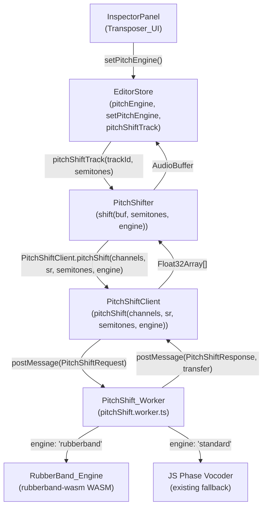

# Design Document: Rubber Band Pitch Shifter

## Overview

This feature replaces the existing FFmpeg `asetrate + aresample` pitch-shifting pipeline in MusicVid Pro with the **Rubber Band Library** via WebAssembly (`rubberband-wasm`). The Rubber Band Library is a phase-locked vocoder used in professional DAWs that preserves transients and formants while shifting pitch, producing significantly higher quality output than the resampling-based approach — especially at larger semitone intervals.

The implementation is strictly client-side. All pitch-shifting work runs in the existing `PitchShift_Worker` Web Worker, keeping the main thread free. The active engine is surfaced to the user via a badge/toggle in the Transposer section of the Inspector Panel, and the selection is persisted in the Zustand store.

### Key Design Decisions

- **`rubberband-wasm` as the WASM source**: The `rubberband-wasm` npm package provides a pre-compiled WASM build of the Rubber Band Library with a JavaScript factory function. This avoids the complexity of compiling from source and is the standard distribution mechanism for browser use.
- **Worker-side initialization with request queuing**: The WASM module is initialized asynchronously when the worker first loads. Requests arriving before initialization completes are queued and drained in order once the engine is ready, ensuring no requests are dropped.
- **Engine selection flows from store → PitchShifter → PitchShiftClient → Worker**: The `pitchEngine` value lives in `ProcessingSlice`. The `pitchShiftTrack` store action reads it and passes it to `PitchShifter.shift()`, which forwards it to `PitchShiftClient.pitchShift()`, which includes it in the `PitchShiftRequest`. This keeps `AudioProcessor` decoupled from the store.
- **FFmpeg path fully removed from PitchShifter**: `PitchShifter.shiftWithFFmpeg()` is deleted. All non-zero semitone operations go through the worker. The zero-semitone fast path (return input unchanged) is retained.
- **WASM heap memory managed per-operation**: Each pitch-shift operation allocates heap memory for input channel data, processes it, copies output back to JS Float32Arrays, then frees all pointers — even on error. This prevents memory leaks over repeated operations.

---

## Architecture



### Data Flow for a Pitch-Shift Operation

1. User adjusts pitch slider and clicks Apply in `InspectorPanel`.
2. `pitchShiftTrack(trackId, semitones)` is called on the store.
3. The store reads `state.pitchEngine` and calls `PitchShifter.shift(audioBuffer, semitones, { engine })`.
4. `PitchShifter` extracts `Float32Array` channel data from the `AudioBuffer` and calls `PitchShiftClient.pitchShift(channels, sampleRate, semitones, engine)`.
5. `PitchShiftClient` constructs a `PitchShiftRequest` (including `engine`) and posts it to the worker with zero-copy transfer of channel buffers.
6. The worker routes to `RubberBand_Engine` or the JS Phase Vocoder based on `engine`.
7. For `'rubberband'`: allocates WASM heap, processes each channel, copies output back to JS, frees heap.
8. The worker posts a `PitchShiftResponse` back with output `Float32Array[]` as Transferables.
9. `PitchShiftClient` resolves the pending promise with the output channels.
10. `PitchShifter` reconstructs an `AudioBuffer` via `AudioContext.createBuffer()` and returns it.
11. The store updates the track's `buffer` and `duration`.

---

## Components and Interfaces

### 1. `PitchShiftRequest` (updated)

```typescript
export type PitchShiftRequest = {
  id: string;
  type: 'pitchShift';
  channels: Float32Array[];
  sampleRate: number;
  semitones: number;
  options: PitchShiftOptions;
  engine: 'rubberband' | 'standard'; // NEW
};
```

### 2. `PitchShiftResponse` (unchanged)

```typescript
export type PitchShiftResponse =
  | { id: string; type: 'pitchShift'; channels: Float32Array[]; sampleRate: number }
  | { id: string; type: 'pitchShift'; error: string };
```

### 3. `PitchShiftClient.pitchShift()` (updated signature)

```typescript
pitchShift(
  channels: Float32Array[],
  sampleRate: number,
  semitones: number,
  engine?: 'rubberband' | 'standard',  // NEW, defaults to 'rubberband'
  options?: Partial<PitchShiftOptions>
): Promise<Float32Array[]>
```

### 4. `PitchShifter.shift()` (updated signature)

```typescript
async shift(
  audioBuffer: AudioBuffer,
  semitones: number,
  options?: Partial<PitchShiftOptions> & { engine?: 'rubberband' | 'standard' }
): Promise<AudioBuffer>
```

The `engine` field is extracted from `options` and forwarded to `PitchShiftClient`. Default is `'rubberband'`.

### 5. `PitchShift_Worker` (updated)

The worker gains:
- An async WASM initialization block that runs on startup.
- A request queue (`PitchShiftRequest[]`) that buffers messages arriving before init completes.
- A `processRubberBand()` function that handles WASM heap allocation, processing, and cleanup.
- Engine routing in `onmessage`: dispatches to `processRubberBand()` or the existing `processWithFallback()`.

### 6. `ProcessingSlice` (updated)

```typescript
export interface ProcessingSliceState {
  // ... existing fields ...
  pitchEngine: 'rubberband' | 'standard'; // NEW
}

export interface ProcessingSliceActions {
  // ... existing actions ...
  setPitchEngine: (engine: 'rubberband' | 'standard') => void; // NEW
}

export const processingInitialState: ProcessingSliceState = {
  // ... existing fields ...
  pitchEngine: 'rubberband', // NEW
};
```

### 7. `EditorStore` (updated)

- `pitchShiftTrack` reads `state.pitchEngine` and passes it to `PitchShifter.shift()`.
- `setPitchEngine` action updates `state.pitchEngine`.
- The `persist` middleware already serializes `ProcessingSlice` state, so `pitchEngine` is persisted automatically.

### 8. `InspectorPanel` — Transposer section (updated)

The Transposer heading row gains an engine badge/toggle:

```tsx
// Engine badge — shows current engine, click to toggle
<button
  onClick={() => setPitchEngine(pitchEngine === 'rubberband' ? 'standard' : 'rubberband')}
  disabled={isProcessing}
  className={pitchEngine === 'rubberband'
    ? 'badge-purple'   // "Engine: Rubber Band (Pro)"
    : 'badge-neutral'  // "Engine: Standard"
  }
>
  {pitchEngine === 'rubberband' ? 'Engine: Rubber Band (Pro)' : 'Engine: Standard'}
</button>
```

---

## Data Models

### WASM Heap Memory Layout (per channel, per operation)

```
WASM heap:
  [inputPtr]   Float32Array of input samples  (length = channel.length)
  [outputPtr]  Float32Array of output samples (length = channel.length, allocated after processing)
```

Each channel is processed independently. Pointers are allocated with `_malloc(length * 4)` (4 bytes per float32) and freed with `_free(ptr)` after the output is copied to a JS `Float32Array`.

### RubberBand Processor Configuration

For each pitch-shift operation, the Rubber Band processor is configured with:

| Option | Value | Condition |
|--------|-------|-----------|
| `RubberBandOptionPitchHighQuality` | always set | Phase-locked vocoder mode |
| `RubberBandOptionTransientsCrisp` | `transientPreservation: true` | Sharp transient preservation |
| `RubberBandOptionTransientsSmooth` | `transientPreservation: false` | Smooth transient handling |
| `RubberBandOptionFormantPreserved` | `formantCorrection: true` | Preserve spectral envelope |
| `RubberBandOptionFormantShifted` | `formantCorrection: false` | Shift spectral envelope with pitch |

### `pitchEngine` State

| Value | Description | Badge style |
|-------|-------------|-------------|
| `'rubberband'` | Rubber Band WASM (default) | Purple badge, "Engine: Rubber Band (Pro)" |
| `'standard'` | JS Phase Vocoder fallback | Neutral badge, "Engine: Standard" |

---

## Correctness Properties

*A property is a characteristic or behavior that should hold true across all valid executions of a system — essentially, a formal statement about what the system should do. Properties serve as the bridge between human-readable specifications and machine-verifiable correctness guarantees.*

### Property 1: Duration Preservation

*For any* valid `AudioBuffer` and any semitone value in `[-48, +48]`, the output `AudioBuffer` produced by the pitch-shifting pipeline SHALL have a `duration` that differs from the input `duration` by no more than 10 milliseconds, and SHALL have the same `sampleRate` and `numberOfChannels` as the input.

**Validates: Requirements 3.1, 3.2, 3.3, 11.3, 11.6**

### Property 2: Engine Field Forwarding

*For any* engine value (`'rubberband'` or `'standard'`) passed to `PitchShiftClient.pitchShift()`, the `PitchShiftRequest` message sent to the worker SHALL contain an `engine` field equal to that value.

**Validates: Requirements 6.2, 7.2, 11.1**

### Property 3: Default Engine is Rubber Band

*For any* call to `PitchShifter.shift()` that does not explicitly provide an `engine` option, the `PitchShiftRequest` forwarded to the worker SHALL have `engine: 'rubberband'`.

**Validates: Requirements 7.1, 11.5**

### Property 4: FFmpeg Path Eliminated

*For any* semitone value in `[-48, +48]` (including non-zero values), calling `AudioProcessor.pitchShift()` SHALL NOT invoke `MediaJobQueue.getInstance().enqueue()`.

**Validates: Requirements 7.3, 10.3, 11.2**

### Property 5: WASM Heap Round-Trip Fidelity

*For any* `Float32Array` of valid audio samples written to the WASM heap and subsequently read back into a JavaScript `Float32Array`, each sample value SHALL be numerically equivalent to the original within IEEE 754 float32 precision (relative error < 1e-6).

**Validates: Requirements 2.5**

### Property 6: Init-Failure Error Propagation

*For any* `PitchShiftRequest` with `engine: 'rubberband'` sent after the WASM engine has failed to initialize, the `PitchShiftResponse` SHALL contain an `error` field describing the failure.

**Validates: Requirements 1.4**

### Property 7: Invalid Engine Rejection

*For any* `PitchShiftRequest` with an `engine` value that is neither `'rubberband'` nor `'standard'`, the `PitchShiftResponse` SHALL contain an `error` field.

**Validates: Requirements 5.3**

### Property 8: setPitchEngine State Update

*For any* valid engine value (`'rubberband'` or `'standard'`), calling `setPitchEngine(value)` on the EditorStore SHALL result in `state.pitchEngine === value`.

**Validates: Requirements 8.2**

---

## Error Handling

### WASM Initialization Failure

If `rubberband-wasm` fails to load (network error, WASM not supported, module error), the worker sets an internal `wasmFailed: true` flag. All subsequent requests with `engine: 'rubberband'` receive a `PitchShiftResponse` with `error: 'RubberBand engine failed to initialize: <reason>'`. The `'standard'` engine path is unaffected.

The `PitchShifter` class surfaces this as an `AppError` with code `'PITCH_SHIFT_UNAVAILABLE'` and a user-facing message: *"Pitch shifting is unavailable. The audio processing library failed to load."*

### WASM Heap Allocation Failure

If `_malloc` returns a null pointer (out of memory), the worker throws before any processing occurs. No heap memory is leaked. The error is returned as a `PitchShiftResponse` with an `error` field.

### WASM Processing Error

If the Rubber Band processor throws during processing (e.g., invalid sample rate, zero-length input), all allocated heap pointers are freed in a `finally` block before the error response is sent.

### Worker Crash

If the worker crashes (unhandled exception), `PitchShiftClient.onerror` rejects all pending promises with `'PitchShift worker crashed'` and sets `this.worker = null` so the next call re-creates the worker. This is the existing behavior and is unchanged.

### Request Queuing During Init

Requests arriving before WASM init completes are pushed onto an internal queue. If init fails, all queued requests are drained with error responses. If init succeeds, queued requests are processed in FIFO order.

---

## Testing Strategy

### Unit Tests (`__tests__/pitchShifter.test.ts`)

The existing test file is extended with:

1. **`engine` field in PitchShiftRequest** — verify `PitchShiftClient.pitchShift()` includes the `engine` field with the value passed in (covers Requirement 6.2).
2. **Default engine** — verify `PitchShifter.shift()` without an explicit `engine` option forwards `engine: 'rubberband'` to the client (covers Requirement 7.1).
3. **No MediaJobQueue calls** — verify `AudioProcessor.pitchShift()` never calls `MediaJobQueue.enqueue()` for any semitone value (covers Requirements 7.3, 10.3). Already partially covered by existing tests; extended to cover the rubberband path.
4. **`pitchEngine` initial state** — verify `processingInitialState.pitchEngine === 'rubberband'` (covers Requirement 8.1).
5. **Duration invariant with mocked worker** — verify that when the worker returns channel data of the same length as the input, `output.duration === input.duration` (covers Requirement 11.3).

### Property-Based Tests (`__tests__/pitchShifter.property.test.ts`)

Uses `fast-check` (already a dev dependency). Each property runs a minimum of 100 iterations.

**Property 1: Duration Preservation**
```
// Feature: rubberband-pitch-shifter, Property 1: Duration Preservation
fc.asyncProperty(
  fc.float({ min: -48, max: 48, noNaN: true }),
  fc.integer({ min: 1, max: 2 }),        // channels
  fc.integer({ min: 1, max: 441000 }),   // length
  async (semitones, channels, length) => {
    // mock worker returns same-length channels
    const output = await processor.pitchShift(makeAudioBuffer(length, channels), semitones);
    expect(Math.abs(output.duration - input.duration)).toBeLessThan(0.01);
    expect(output.sampleRate).toBe(input.sampleRate);
    expect(output.numberOfChannels).toBe(input.numberOfChannels);
  }
)
```

**Property 2: Engine Field Forwarding**
```
// Feature: rubberband-pitch-shifter, Property 2: Engine Field Forwarding
fc.property(
  fc.constantFrom('rubberband', 'standard'),
  (engine) => {
    // capture the postMessage call and verify engine field
    expect(capturedRequest.engine).toBe(engine);
  }
)
```

**Property 3: Default Engine is Rubber Band**
```
// Feature: rubberband-pitch-shifter, Property 3: Default Engine is Rubber Band
// Call PitchShifter.shift() without engine option, verify forwarded engine === 'rubberband'
```

**Property 4: FFmpeg Path Eliminated**
```
// Feature: rubberband-pitch-shifter, Property 4: FFmpeg Path Eliminated
fc.asyncProperty(
  fc.float({ min: -48, max: 48, noNaN: true }).filter(s => s !== 0),
  async (semitones) => {
    await processor.pitchShift(validBuffer, semitones);
    expect(mockEnqueue).not.toHaveBeenCalled();
  }
)
```

**Property 5: WASM Heap Round-Trip Fidelity**
```
// Feature: rubberband-pitch-shifter, Property 5: WASM Heap Round-Trip Fidelity
fc.property(
  fc.array(fc.float({ noNaN: true, min: -1, max: 1 }), { minLength: 1, maxLength: 4096 }),
  (samples) => {
    const input = new Float32Array(samples);
    // write to WASM heap via _malloc, read back via HEAPF32
    const output = readBackFromHeap(input);
    for (let i = 0; i < input.length; i++) {
      expect(Math.abs(output[i] - input[i])).toBeLessThan(1e-6);
    }
  }
)
```

**Property 6: Init-Failure Error Propagation**
```
// Feature: rubberband-pitch-shifter, Property 6: Init-Failure Error Propagation
// Simulate WASM init failure, generate random requests, verify all responses have error field
```

**Property 7: Invalid Engine Rejection**
```
// Feature: rubberband-pitch-shifter, Property 7: Invalid Engine Rejection
fc.asyncProperty(
  fc.string().filter(s => s !== 'rubberband' && s !== 'standard'),
  async (invalidEngine) => {
    const response = await sendWorkerRequest({ engine: invalidEngine });
    expect('error' in response).toBe(true);
  }
)
```

**Property 8: setPitchEngine State Update**
```
// Feature: rubberband-pitch-shifter, Property 8: setPitchEngine State Update
fc.property(
  fc.constantFrom('rubberband', 'standard'),
  (engine) => {
    store.getState().setPitchEngine(engine);
    expect(store.getState().pitchEngine).toBe(engine);
  }
)
```

### Property Reflection

After reviewing all properties:

- Properties 1 (Duration Preservation) subsumes the separate sampleRate and numberOfChannels checks — combined into one format-preservation property.
- Properties 2 (Engine Field Forwarding) and 3 (Default Engine) are distinct: Property 2 tests explicit engine values, Property 3 tests the default. Both are retained.
- Property 4 (FFmpeg Path Eliminated) is distinct from Property 2 — it tests a negative invariant (no MediaJobQueue calls), not engine routing.
- Properties 6 and 7 are distinct error conditions (init failure vs. invalid engine value) and are both retained.
- Requirements 3.1, 3.2, 3.3, 11.3, and 11.6 all map to Property 1 — no redundancy in the property list.
- Requirements 6.2, 7.2, and 11.1 all map to Property 2 — no redundancy.

Final property count: 8 properties, each providing unique validation value.

### Integration Tests

- Verify the `rubberband-wasm` module loads successfully in a Node.js/JSDOM environment (or skip with a note if WASM is not available in the test runner).
- Verify end-to-end: `pitchShiftTrack` with `pitchEngine: 'rubberband'` produces an `AudioBuffer` with the correct duration.

### Test Configuration

- Property tests: minimum 100 iterations per property (`{ numRuns: 100 }`).
- Tag format: `// Feature: rubberband-pitch-shifter, Property N: <property_text>`
- Test runner: `npx vitest --run`
