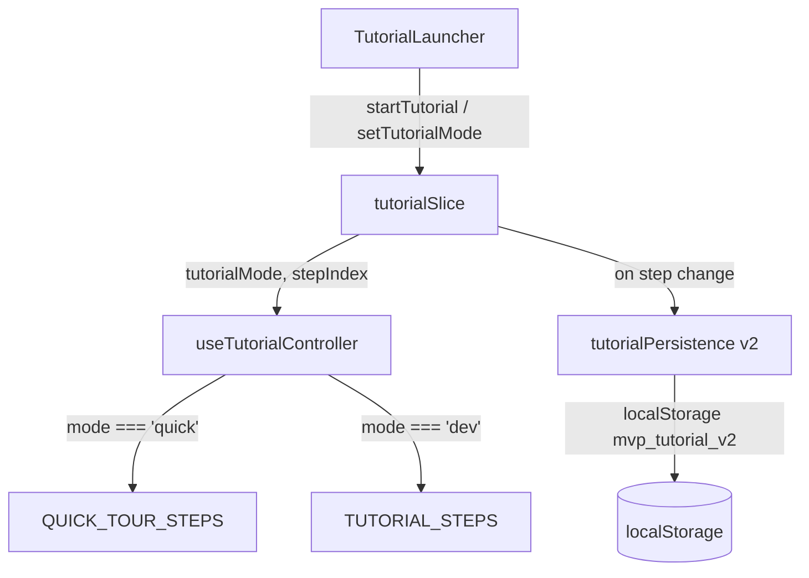

# Design Document: Tutorial Modes

## Overview

This feature adds a **Quick Tour** (10 steps) alongside the existing **Dev Tour** (52 steps), letting users choose their preferred depth before starting the tutorial. The change is intentionally minimal: a new `QUICK_TOUR_STEPS` array, a `tutorialMode` field in state, a new localStorage key (`mvp_tutorial_v2`) with independent per-mode step indices, and updated UI in `TutorialLauncher` to offer mode selection.

The existing `TutorialOverlay`, `TutorialTooltip`, spotlight/scroll logic in `useTutorialController`, and `TUTORIAL_STEPS` are all left untouched.

---

## Architecture

The change touches four layers, each minimally:

```
TutorialLauncher (UI)
  └─ reads/writes tutorialMode via editorStore
       └─ tutorialSlice (state)
            └─ useTutorialController (derives active step array from mode)
                 └─ tutorialPersistence (new v2 schema)
```



No new components are introduced. `TutorialOverlay` and `TutorialTooltip` receive the mode label as a prop addition only.

---

## Components and Interfaces

### `lib/tutorial/tutorialSteps.ts` — additions only

Add `QUICK_TOUR_STEPS` array (10 steps). `TUTORIAL_STEPS` and `TutorialModule` are read-only.

```ts
export const QUICK_TOUR_STEPS: TutorialStep[] = [ /* 10 steps, ids prefixed qt- */ ];
```

### `lib/tutorial/tutorialPersistence.ts` — new v2 schema

New key `mvp_tutorial_v2`. New type:

```ts
export type TutorialMode = 'quick' | 'dev';

export type TutorialProgressV2 = {
  mode: TutorialMode;
  quickStepIndex: number;
  devStepIndex: number;
  quickCompleted: boolean;
  devCompleted: boolean;
  dismissed: boolean;
};
```

Old `mvp_tutorial_v1` key is left in place (not deleted). On first load with no v2 key, the system checks for a v1 key and migrates: `mode: 'dev'`, `devStepIndex: v1.stepIndex`, `devCompleted: v1.completed`, `dismissed: v1.dismissed`.

### `stores/slices/tutorialSlice.ts` — new state fields

```ts
export interface TutorialState {
  // existing fields unchanged
  tutorialActive: boolean;
  tutorialCurrentStepIndex: number;
  tutorialCompleted: boolean;
  tutorialDismissed: boolean;
  tutorialShowWelcome: boolean;
  // new
  tutorialMode: TutorialMode;           // 'quick' | 'dev'
  tutorialQuickStepIndex: number;       // independent progress for quick mode
  tutorialDevStepIndex: number;         // independent progress for dev mode
}
```

New action added to `TutorialActions`:

```ts
setTutorialMode: (mode: TutorialMode) => void;
```

`buildInitialState()` is updated to hydrate from `loadTutorialProgressV2()`, populating both per-mode indices and the active mode.

### `lib/hooks/useTutorialController.ts` — mode-aware step array

The only change: derive `activeSteps` from `tutorialMode` instead of hardcoding `TUTORIAL_STEPS`.

```ts
const tutorialMode = useEditorStore((s) => s.tutorialMode);
const activeSteps = tutorialMode === 'quick' ? QUICK_TOUR_STEPS : TUTORIAL_STEPS;
const currentStep = tutorialActive ? (activeSteps[tutorialCurrentStepIndex] ?? null) : null;
// totalSteps and currentStepNumber use activeSteps.length
```

The spotlight, scroll, resize, and debounced-persist logic is unchanged.

### `components/editor/TutorialLauncher.tsx` — mode selection UI

Two dialog changes:

1. **Welcome dialog** — adds a `RadioGroup` for mode selection (Quick Tour default), replaces the single "Start Tutorial" button with a "Start" button that calls `setTutorialMode(selectedMode)` then `startTutorial()`.

2. **Restart/Resume dialog** — adds Quick Tour and Dev Tour restart options alongside the existing Resume and Skip buttons.

Mode label is passed down to `TutorialOverlay` / displayed in the step counter area via a prop or by reading `tutorialMode` from the store directly in `TutorialTooltip`.

### `components/editor/TutorialTooltip.tsx` — mode label display

Reads `tutorialMode` from the store (or receives as prop) and renders the label next to the step counter: `"Quick Tour · Step 3 of 10"` or `"Dev Tour · Step 7 of 52"`.

Completion message is conditional on mode:
- `'quick'`: "Quick Tour complete! Open the Dev Tour from the ? button for a deep dive."
- `'dev'`: existing completion message.

---

## Data Models

### `TutorialProgressV2` (localStorage `mvp_tutorial_v2`)

```ts
type TutorialProgressV2 = {
  mode: 'quick' | 'dev';
  quickStepIndex: number;   // 0-based, clamped to [0, QUICK_TOUR_STEPS.length - 1]
  devStepIndex: number;     // 0-based, clamped to [0, TUTORIAL_STEPS.length - 1]
  quickCompleted: boolean;
  devCompleted: boolean;
  dismissed: boolean;
};
```

### Migration from v1

```ts
function loadTutorialProgressV2(): TutorialProgressV2 | null {
  // 1. Try v2 key
  // 2. If absent, try v1 key and migrate
  // 3. If both absent, return null (new user)
}
```

### `TutorialMode` type

```ts
export type TutorialMode = 'quick' | 'dev';
```

Exported from `tutorialPersistence.ts` and re-exported from `tutorialSlice.ts`.

### `TutorialState` additions

| Field | Type | Default | Description |
|---|---|---|---|
| `tutorialMode` | `TutorialMode` | `'quick'` (new user) / `'dev'` (migrated) | Active mode |
| `tutorialQuickStepIndex` | `number` | `0` | Saved progress for quick mode |
| `tutorialDevStepIndex` | `number` | `0` | Saved progress for dev mode |

`tutorialCurrentStepIndex` continues to be the live index used by `useTutorialController`. On mode switch, it is set to the saved index for the new mode.

---

## Correctness Properties

*A property is a characteristic or behavior that should hold true across all valid executions of a system — essentially, a formal statement about what the system should do. Properties serve as the bridge between human-readable specifications and machine-verifiable correctness guarantees.*

### Property 1: QUICK_TOUR_STEPS structural invariants

*For every* step in `QUICK_TOUR_STEPS`, the step's `id` SHALL start with `'qt-'`, all ids SHALL be unique across the array, the `module` SHALL be a valid `TutorialModule` value, and the `body` text SHALL contain no more than 3 sentences.

**Validates: Requirements 2.4, 2.5, 2.6**

### Property 2: Persistence round-trip preserves mode and independent step indices

*For any* valid `TutorialMode` value and any pair of step indices `(quickIdx, devIdx)` within their respective array bounds, saving a `TutorialProgressV2` record and then loading it SHALL return a record with the same `mode`, `quickStepIndex`, and `devStepIndex`.

**Validates: Requirements 5.1, 5.2, 5.3**

### Property 3: Stale step index is reset to 0

*For any* step index that is greater than or equal to the length of the `Active_Step_Array` for the current `Tutorial_Mode`, loading tutorial progress SHALL result in `tutorialCurrentStepIndex` being reset to `0` for that mode.

**Validates: Requirements 4.5**

### Property 4: totalSteps matches the active step array length

*For any* `Tutorial_Mode`, the `totalSteps` value returned by `useTutorialController` SHALL equal the length of the corresponding step array (`QUICK_TOUR_STEPS.length` for `'quick'`, `TUTORIAL_STEPS.length` for `'dev'`).

**Validates: Requirements 4.4**

### Property 5: Mode label is present in the tutorial tooltip

*For any* active tutorial state with any `Tutorial_Mode`, the rendered tutorial tooltip SHALL contain the string `"Quick Tour"` when mode is `'quick'` and `"Dev Tour"` when mode is `'dev'`.

**Validates: Requirements 6.1**

---

## Error Handling

- **localStorage unavailable**: `loadTutorialProgressV2` and `saveTutorialProgressV2` wrap all calls in try/catch and fail silently, matching the existing v1 pattern. In-memory state remains correct.
- **Corrupt v2 JSON**: `loadTutorialProgressV2` returns `null` on parse failure; the system treats this as a new user.
- **Stale step index**: If `quickStepIndex >= QUICK_TOUR_STEPS.length` or `devStepIndex >= TUTORIAL_STEPS.length`, the affected index is clamped to `0` during hydration in `buildInitialState()`.
- **Unknown mode value in storage**: If the stored `mode` is not `'quick'` or `'dev'`, default to `'dev'` for backward compatibility.
- **Missing v2 key with v1 present**: Migrate silently; do not delete the v1 key (allows rollback).

---

## Testing Strategy

This feature involves pure data transformations (persistence schema, step array derivation) and UI state logic — both well-suited to unit and property-based testing. The rendering layer (TutorialLauncher dialogs, tooltip label) is covered by example-based component tests.

**Property-based testing library**: `fast-check` (already available in the JS ecosystem; add as a dev dependency).

### Property Tests (minimum 100 iterations each)

Each test references its design property via a comment tag.

- **P1 — QUICK_TOUR_STEPS structural invariants**
  `// Feature: tutorial-modes, Property 1: QUICK_TOUR_STEPS structural invariants`
  Iterate over all 10 steps and assert id prefix, uniqueness, valid module, body sentence count.

- **P2 — Persistence round-trip**
  `// Feature: tutorial-modes, Property 2: Persistence round-trip preserves mode and independent step indices`
  Generate arbitrary `(mode, quickIdx, devIdx, flags)` tuples within valid bounds; save then load; assert equality.

- **P3 — Stale index reset**
  `// Feature: tutorial-modes, Property 3: Stale step index is reset to 0`
  Generate step indices >= array length for each mode; assert hydrated `tutorialCurrentStepIndex === 0`.

- **P4 — totalSteps matches array length**
  `// Feature: tutorial-modes, Property 4: totalSteps matches the active step array length`
  For each mode, assert `useTutorialController` returns `totalSteps === activeSteps.length`.

- **P5 — Mode label in tooltip**
  `// Feature: tutorial-modes, Property 5: Mode label is present in the tutorial tooltip`
  For each mode, render the tooltip and assert the correct label string is present.

### Unit / Example Tests

- `QUICK_TOUR_STEPS.length === 10`
- Each step's `id`, `targetSelector`, `title`, `tooltipPlacement` matches the spec (Requirement 7)
- `TUTORIAL_STEPS.length === 52` (preservation check)
- Selecting Quick Tour in Welcome dialog calls `setTutorialMode('quick')` then `startTutorial()`
- Selecting Dev Tour calls `setTutorialMode('dev')` then `startTutorial()`
- Default selection in Welcome dialog is Quick Tour
- Dismissing Welcome dialog sets `tutorialDismissed=true`, `tutorialActive=false`
- Loading v1 progress with no v2 key migrates to `mode: 'dev'`
- Completing Quick Tour shows completion message mentioning "Dev Tour"
- Mode-Selection_Dialog shows all four options when help button clicked on returning user

### Integration Tests

- `targetSelector` values in `QUICK_TOUR_STEPS` match `data-tutorial` attributes in the rendered editor (DOM query check in a full render test)
